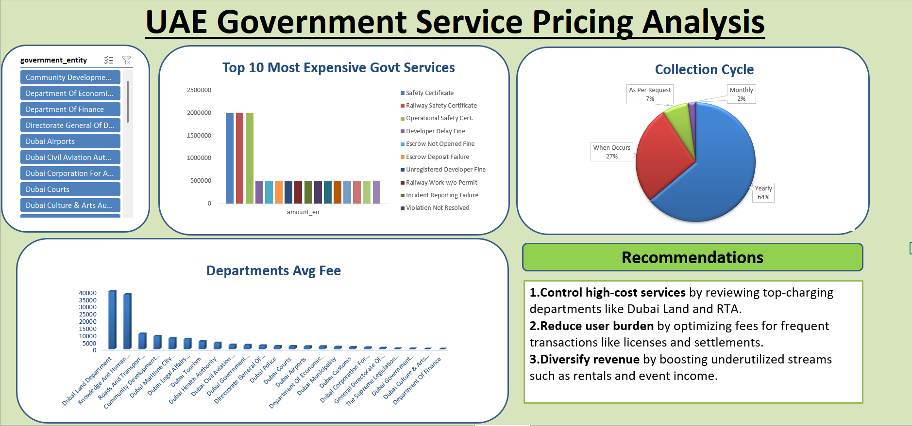

# 💰 UAE Government Service Pricing Analysis

This project analyzes and visualizes the pricing of various UAE government services to uncover patterns, high-cost areas, and collection frequencies.

## 📊 Tools Used
- **Power BI** – for data visualization
- **Excel** – for data cleaning & exploration

## 🧠 Insights
- Identified top revenue-generating departments
- Highlighted expensive services and service frequency
- Grouped services by revenue type for better breakdown

## 🖼️ Dashboard Preview

## 📂 Files
- `uae-pricing.png` – Power BI dashboard screenshot
- `UAE_Government_Dashboard.pbix` – Power BI file (optional)
- `data.xlsx` – raw or processed data (optional)

## 👩‍💻 Author
[Ruthika Thorat](https://ruthika619.github.io) – Aspiring Data Analyst
